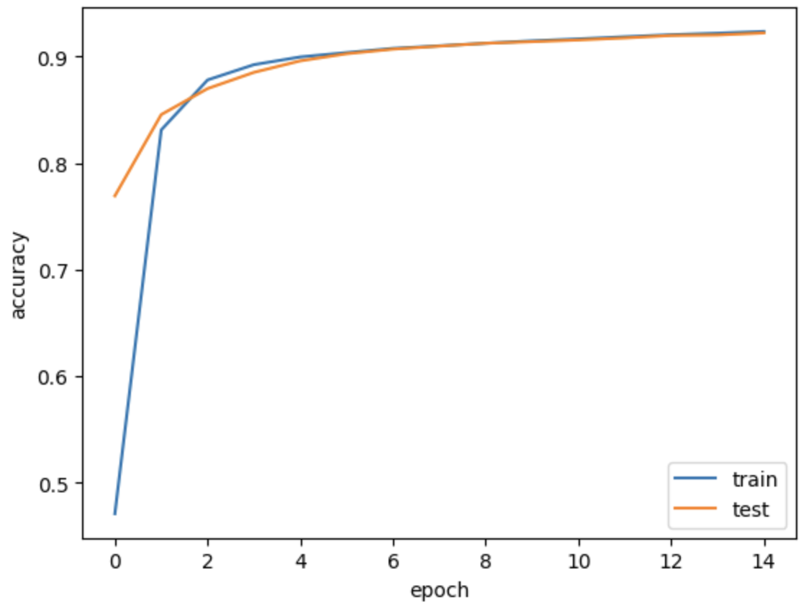

# ロボットインテリジェンス課題

## 環境の構築
anacondaを使用し、環境構築<br>
pythonのversionは3.12
```bash
conda create -n env_name python==3.12
```


## 必要ライブラリのインストール

```bash
pip install requirements
```

使用したライブラリは以下  
- numpy
- matplotlib
- tqdm


## 訓練結果の確認
result.ipynbに訓練過程とそのaccuracyがまとめられている。  
result.ipynbの各セルを実行すると、トレーニングが実行され、その結果が描画されるようになっている。  

```bash
# 例
optimizer_sgd = SGD(0.1)
model= MLP([Affine(784,1000),Sigmoid(),Affine(1000,1000),Sigmoid(),Affine(1000,10),Softmax()])
optimizer_sgd.set(model)

### 訓練開始
train_loss_list, train_acc_list, test_loss_list, test_acc_list = train(model, optimizer_sgd,error_ratio=0)

### trainデータの訓練結果
plt.plot(np.arange(len(train_acc_list)),np.asarray(train_acc_list),label = "train")
plt.plot(np.arange(len(test_acc_list)),np.asarray(test_acc_list),label = "test")

plt.xlabel("epoch")
plt.ylabel("accuracy")

plt.legend()
plt.show()
```
